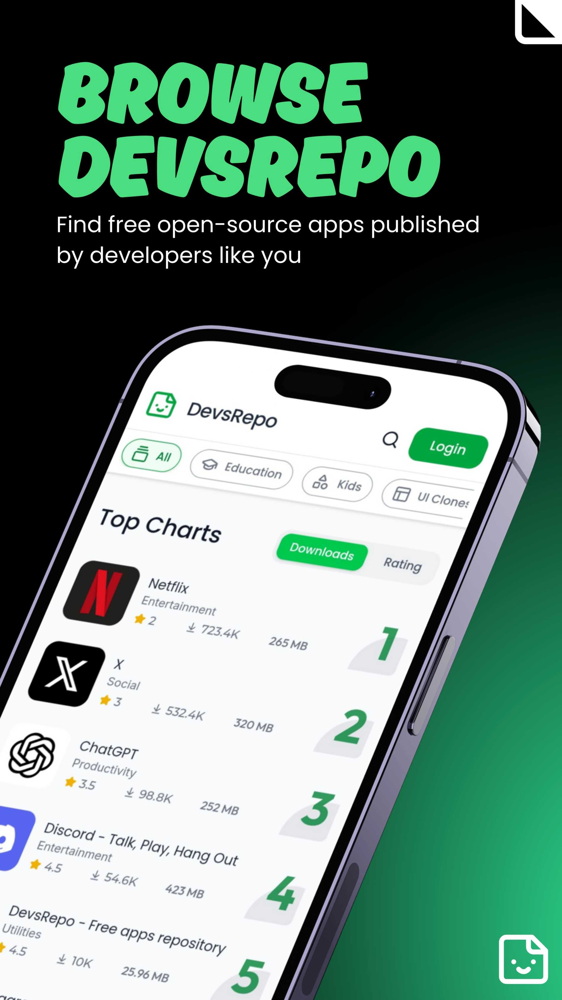
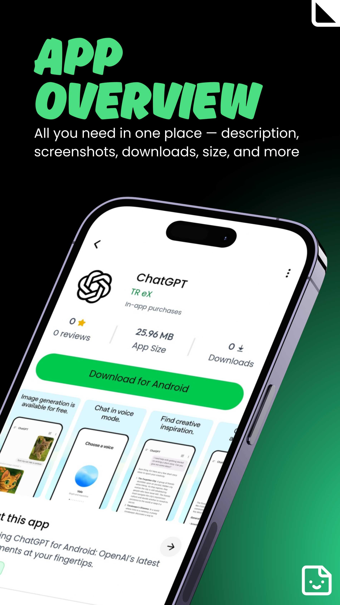
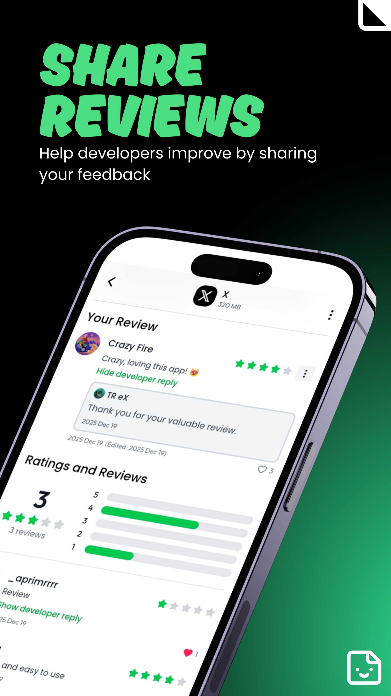
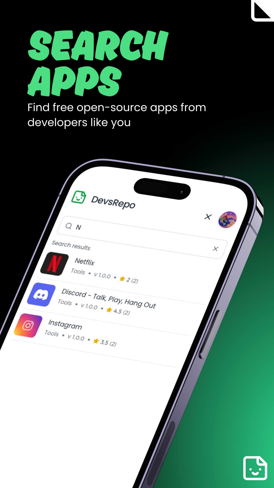
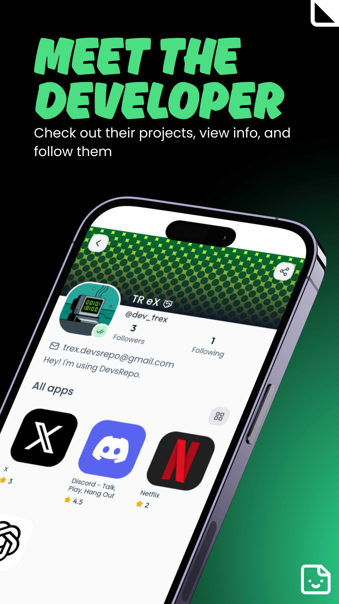
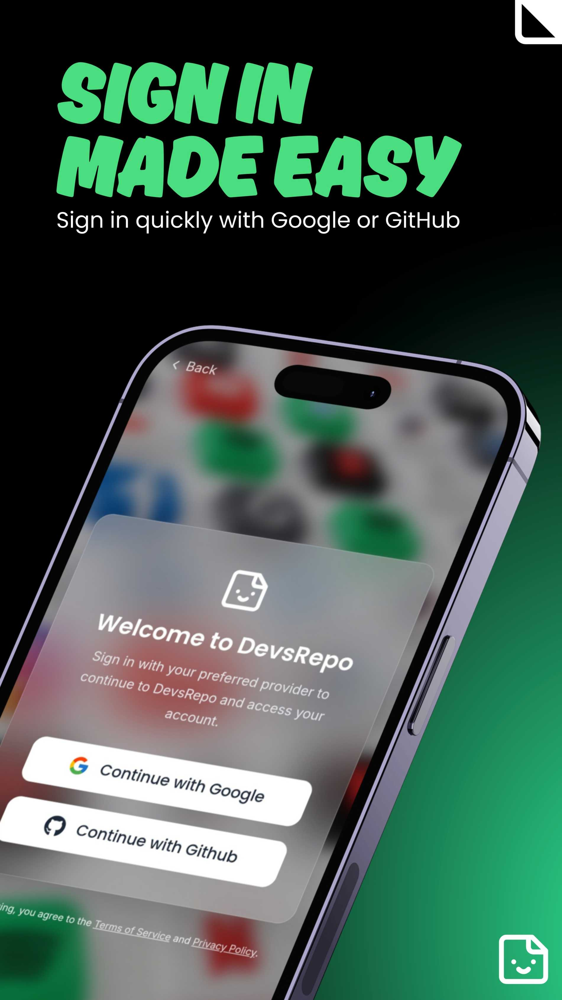
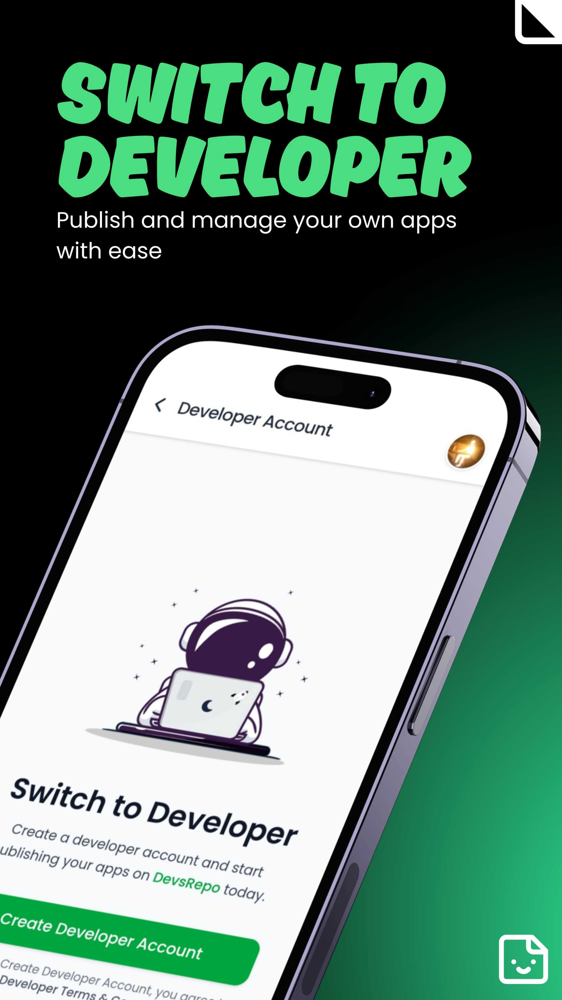
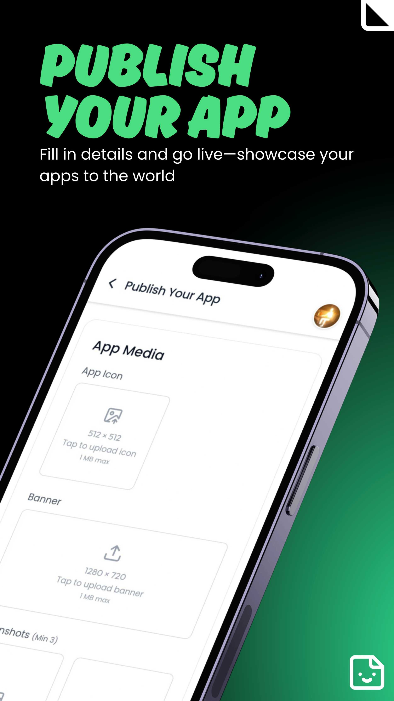

<div align="center">

# 🧑‍💻 DevsRepo

**A Modern Alternative to the App Store & Play Store**  
Built for developers who want freedom and users who love discovering new apps.

<br/>

[](https://reactjs.org/)
[](https://tailwindcss.com/)
[](https://firebase.google.com/)
[](https://appwrite.io/)
[](LICENSE)

</div>

---

## 🚀 What is DevsRepo?

DevsRepo is an open platform designed to remove the common friction points associated with major app stores. It exists to support developers who can't publish on major stores due to **cost, strict policies, or hosting limits**.

    “DevsRepo exists because every developer deserves a place to showcase their apps — not just those who can afford it.”

#### For Developers:

- **Publish** their apps without paying huge store fees.
- **Manage and update** their apps with ease.
- **Showcase** projects in a clean, user-friendly interface.
- **Share** direct download links instantly.

#### For Users:

- **Browse** apps in a simple, modern UI.
- **Discover** new indie developers.
- **Download** apps directly — fast & free.

---

## 🖼️ Screenshots

<p align="center">
  
  
  
</p>

<p align="center">
  
  
  
</p>

<p align="center">
  
  
  
</p>

<p align="left">
  
</p>

## 💡 Why DevsRepo?

Many new developers struggle with high barriers to entry. DevsRepo solves these issues by providing a **free, open platform** where developers can launch apps instantly.

| Major Store Pain Points        | DevsRepo Solution                     |
| :----------------------------- | :------------------------------------ |
| 💸 **High publishing fees**    | **Free** to publish and use.          |
| 🚫 **Strict store rules**      | Open and developer-friendly policies. |
| 🕒 **Approval delays**         | Launch apps **instantly**.            |
| ⚙️ **Complicated app updates** | Simple app management for developers. |

---

## 📦 Features

- Developer Profiles
- App Publishing & Management
- Category-based App Discovery
- App Reviews & Ratings
- Trending, New & Top Downloads
- Beautiful App Cards UI
- Secure Authentication
- Direct Download Links

---

## 🏗️ Project Setup

### Installation

1. Clone the repo

```bash
git clone https://github.com/aprimr/devsrepo.git
```

2. Navigate into the project directory

```bash
cd devsrepo
```

3. Install dependencies

```bash
npm install
```

4. Start development server

```bash
npm run dev
```

### Environment Variables

Create a file named .env in the root directory and add your Firebase & appwrite configuration details:

```bash
.env

VITE_FIREBASE_API_KEY=YOUR_API_KEY
VITE_FIREBASE_AUTH_DOMAIN=YOUR_AUTH_DOMAIN
VITE_FIREBASE_PROJECT_ID=YOUR_PROJECT_ID
VITE_FIREBASE_STORAGE_BUCKET=YOUR_STORAGE_BUCKET
VITE_FIREBASE_MESSAGING_SENDER_ID=YOUR_SENDER_ID
VITE_FIREBASE_APP_ID=YOUR_APP_ID

VITE_APPWRITE_ENDPOINT = YOUR_APPWRITE_ENDPOINT
VITE_APPWRITE_PROJECT_ID = YOUR_APPWRITE_PROJECT_ID
VITE_APPWRITE_BUCKET_ID = YOUR_APPWRITE_BUCKET_ID
```

## 🤝 Contributing

Contributions are welcome and highly appreciated!

1. **Fork the repository** to your GitHub account.
2. **Clone your fork** to your local machine:

```bash
git clone https://github.com/aprimr/devsrepo.git
cd devsrepo
```

3. Create a new branch for your feature or fix:

```bash
git checkout -b feature/my-awesome-feature
```

4. Make your changes and commit them with a clear message:

```bash
git add .
git commit -m "Add some feature"
```

5. Push your branch to your fork:

```bash
git push origin feature/my-awesome-feature
```

6. Open a Pull Request from your branch to the main repository.

## ⭐ Support the Project

If you like DevsRepo, please consider giving the repo a star on GitHub. It helps the project grow and reach more developers!

## 🧾 License

This project is licensed under the MIT License — free to use and modify.

    Made with ❤️ for the developers.
